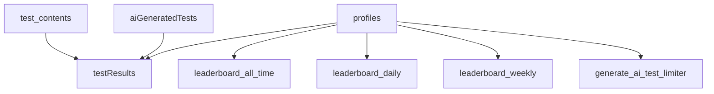

# ZenType Firestore Schema Documentation

## Overview
This document defines the complete Firestore database schema for the ZenType application. This schema is the **authoritative source** for all collection structures, field types, and data relationships.

**Last Updated**: January 2025  
**Status**: ✅ Active and Verified  
**Collections Count**: 8 primary collections

---

## Collection Structure

### 1. `profiles` Collection
**Purpose**: User profile data and statistics  
**Document ID**: Firebase Auth UID

```typescript
interface UserProfile {
  id: string;                    // Document ID (Firebase Auth UID)
  email: string;                 // User's email address
  displayName: string;           // User's display name
  createdAt: string;            // ISO timestamp
  bio?: string;                 // Optional user biography
  preferredThemeId: string;     // UI theme preference
  preferredFontId: string;      // Font preference for typing
  settings: {
    keyboardSounds: boolean;    // Audio feedback setting
    visualFeedback: boolean;    // Visual feedback setting
    autoSaveAiTests: boolean;   // Auto-save AI generated tests
  };
  stats: {
    rank: string;               // User's typing rank (E, D, C, B, A, S)
    testsCompleted: number;     // Total tests completed
    avgWpm: number;            // Average words per minute
    avgAcc: number;            // Average accuracy percentage
  };
}
```

### 2. `test_contents` Collection ⭐ **PRIMARY TEST SOURCE**
**Purpose**: Pre-made typing tests library  
**Document ID**: Auto-generated

```typescript
interface PreMadeTest {
  id: string;                   // Document ID
  text: string;                 // The typing test content
  difficulty: 'Easy' | 'Medium' | 'Hard';  // Difficulty level
  category: string;             // Test category
  source: string;               // Content source/attribution
  wordCount: number;            // Number of words in test
  timeLimit: number;            // Recommended time limit in seconds
  createdAt: string;           // ISO timestamp
}
```

**Current Categories**:
- `technology` - Tech-related content
- `customer_support` - Customer service scenarios
- `business_finance` - Business and finance content
- `health_medical` - Healthcare and medical content

**Test Distribution**: 48 total tests (4 categories × 4 durations × 3 difficulties)

### 3. `aiGeneratedTests` Collection
**Purpose**: AI-generated typing tests  
**Document ID**: Auto-generated

```typescript
interface AiGeneratedTest {
  id: string;                   // Document ID
  userId: string;               // Creator's Firebase Auth UID
  text: string;                 // Generated test content
  prompt: string;               // Original user prompt
  difficulty: string;           // Requested difficulty
  category: string;             // Test category
  wordCount: number;            // Number of words
  createdAt: string;           // ISO timestamp
  isPublic: boolean;           // Whether test is publicly available
}
```

### 4. `testResults` Collection
**Purpose**: Individual typing test results  
**Document ID**: Auto-generated

```typescript
interface TestResult {
  id: string;                   // Document ID
  userId: string;               // User's Firebase Auth UID
  testId?: string;              // Reference to test_contents or aiGeneratedTests
  testType: 'practice' | 'ai' | 'custom';  // Type of test taken
  wpm: number;                  // Words per minute achieved
  accuracy: number;             // Accuracy percentage (0-100)
  timeSpent: number;           // Time spent in seconds
  completedAt: string;         // ISO timestamp
  mistakes: number;            // Number of typing mistakes
  testText: string;            // The actual text that was typed
  userInput: string;           // What the user actually typed
}
```

### 5. `leaderboard_all_time` Collection
**Purpose**: All-time leaderboard rankings  
**Document ID**: User's Firebase Auth UID

```typescript
interface LeaderboardEntry {
  id: string;                   // Document ID (Firebase Auth UID)
  displayName: string;          // User's display name
  bestWpm: number;             // Best WPM score
  bestAccuracy: number;        // Best accuracy score
  testsCompleted: number;      // Total tests completed
  lastUpdated: string;         // ISO timestamp
}
```

### 6. `leaderboard_daily` Collection
**Purpose**: Daily leaderboard rankings  
**Document ID**: User's Firebase Auth UID

```typescript
interface DailyLeaderboardEntry {
  id: string;                   // Document ID (Firebase Auth UID)
  displayName: string;          // User's display name
  bestWpm: number;             // Best WPM for the day
  bestAccuracy: number;        // Best accuracy for the day
  testsCompleted: number;      // Tests completed today
  date: string;                // Date in YYYY-MM-DD format
  lastUpdated: string;         // ISO timestamp
}
```

### 7. `leaderboard_weekly` Collection
**Purpose**: Weekly leaderboard rankings  
**Document ID**: User's Firebase Auth UID

```typescript
interface WeeklyLeaderboardEntry {
  id: string;                   // Document ID (Firebase Auth UID)
  displayName: string;          // User's display name
  bestWpm: number;             // Best WPM for the week
  bestAccuracy: number;        // Best accuracy for the week
  testsCompleted: number;      // Tests completed this week
  weekStart: string;           // Week start date (YYYY-MM-DD)
  lastUpdated: string;         // ISO timestamp
}
```

### 8. `generate_ai_test_limiter` Collection
**Purpose**: Rate limiting for AI test generation  
**Document ID**: User's Firebase Auth UID

```typescript
interface AiTestLimiter {
  id: string;                   // Document ID (Firebase Auth UID)
  requestCount: number;         // Number of requests made
  lastRequest: string;          // ISO timestamp of last request
  resetTime: string;           // When the counter resets
}
```

---

## API Integration

### Primary Endpoints
- **GET** `/api/v1/tests` - Fetches from `test_contents` collection
- **POST** `/api/submit-test-result` - Writes to `testResults` collection
- **Cloud Functions** - Handle AI generation and complex operations

### Collection Usage by Feature
- **Practice Tests**: `test_contents` → `testResults`
- **AI Tests**: `aiGeneratedTests` → `testResults`
- **User Profiles**: `profiles` (read/write user data)
- **Leaderboards**: `leaderboard_*` collections (aggregated data)

---

## Security Rules Summary

```javascript
// Firestore Security Rules (firestore.rules)
rules_version = '2';
service cloud.firestore {
  match /databases/{database}/documents {
    // Users can only access their own profile
    match /profiles/{userId} {
      allow read, write: if request.auth != null && request.auth.uid == userId;
    }
    
    // Test contents are publicly readable
    match /test_contents/{testId} {
      allow read: if true;
      allow write: if false; // Only server-side writes
    }
    
    // Users can only access their own test results
    match /testResults/{resultId} {
      allow read, write: if request.auth != null && 
        resource.data.userId == request.auth.uid;
    }
    
    // Additional rules for other collections...
  }
}
```

---

## Data Relationships



---

## Migration & Maintenance Notes

### ⚠️ Critical Information
1. **Collection Name**: Always use `test_contents` (NOT `preMadeTests`)
2. **API Compatibility**: All endpoints reference `test_contents`
3. **Data Integrity**: Pre-made tests are populated via generation script
4. **Schema Validation**: TypeScript interfaces enforce data structure

### Recent Changes
- ✅ **January 2025**: Populated `test_contents` with 48 comprehensive tests
- ✅ **Verified**: API endpoints successfully fetch from correct collection
- ✅ **Tested**: Frontend integration working with new schema

### Backup & Recovery
- Generation script: `generate-premade-tests.js`
- Recreation script: `recreate-firestore-collections.js`
- Schema validation: TypeScript interfaces in `/lib/types/database.ts`

---

## Validation Checklist

- [ ] All collections exist in Firestore
- [ ] Security rules are properly configured
- [ ] API endpoints reference correct collections
- [ ] TypeScript interfaces match Firestore data
- [ ] Frontend components use correct data structure
- [ ] Test data is properly seeded

**Status**: ✅ All items verified and working as of January 2025